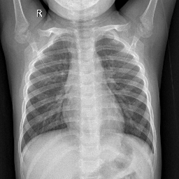

=============
### Mod 4 project
=============

by: Mendel Oster, Andres Chaves

This project was used as Mod 4 project for Flatiron School Data Science program. 

================================================================================

    ├── Data                 <- The original, immutable data dump.
    |
    ├── Notebooks            <- Jupyter notebooks.
    |
    ├── Reports              <- Generated analysis as HTML, PDF, Slides, etc.
    |
    ├── README.md            <- The top-level README for developers using this project.
    |
    └── src                  <- Source code for use in this project.
        |
        └── example.py

===============================================================================

## About
When it comes to diagnosing Pneumonia, chest X-rays are generally the way to go. They are quick, easy, and accessible almost anywhere. In this project we will be using a convolutional neural network to classify chest X-ray images into two classes, healthy and infected patients. 

The dataset we used is from https://www.kaggle.com/paultimothymooney/chest-xray-pneumonia  
- 5216 training images, 3875 instances of pneumonia and 1341 instances of healthy lungs
- 624 testing images, 390 instances of pneumonia and 234 instances of healthy lungs
- 16 validation images, 8 of each class

__________
## Visuals

To the left we can see lungs with Pneumonia, notice the opacity versus the healthy lungs on the right 
 
 

 
 
 
 
 
 
 
 
 
 
 
 
 

## Models

>For scoring the models the main metric we used is 'Recall' - for this project that means out of all sick patients how many were we able to predict correctly.

For the first model we trained a CNN over a subset of training images (250 for each class)  

<insert summary>

This ended with a recall score of 57.95%. Since 62.5% of the testing set is patients with pneumonia the base model of always predicting pneumonia is better. 

For the second model we used Alexnet CNN architecture. At first when trained on the subset, it predicted every test image as healthy.   But when training it over the entire training set, it proved to be very valuable with a recall of 99%! (Precision of 74%)

__Alexnet__  
Train on 5216 samples, validate on 16 samples
Epoch 1/6
5216/5216 [==============================] - 135s 26ms/step - loss: 0.6018 - accuracy: 0.7393 - val_loss: 0.6969 - val_accuracy: 0.5000
Epoch 2/6
5216/5216 [==============================] - 121s 23ms/step - loss: 0.4326 - accuracy: 0.7889 - val_loss: 0.5391 - val_accuracy: 0.8125
Epoch 3/6
5216/5216 [==============================] - 113s 22ms/step - loss: 0.2647 - accuracy: 0.8932 - val_loss: 0.4656 - val_accuracy: 0.7500
Epoch 4/6
5216/5216 [==============================] - 124s 24ms/step - loss: 0.1929 - accuracy: 0.9283 - val_loss: 0.8606 - val_accuracy: 0.7500
Epoch 5/6
5216/5216 [==============================] - 130s 25ms/step - loss: 0.1586 - accuracy: 0.9436 - val_loss: 0.6826 - val_accuracy: 0.6875
Epoch 6/6
5216/5216 [==============================] - 119s 23ms/step - loss: 0.1444 - accuracy: 0.9473 - val_loss: 1.1557 - val_accuracy: 0.6875

Finally, we took this model and trained for 25 epochs which ended up overfitting, improving recall with a slight nudge and decreasing precision by 2 percentage points.

Transfer learning 

(---display number of epochs and scores---) for the readme??
---display confusion matrix----

----display summary table of model---

conclusion
### Final Model Summary
<body>

                                           Model: "sequential_18"
_________________________________________________________________
Layer (type)                 Output Shape              Param #   

=================================================================  

conv2d_52 (Conv2D)           (None, 85, 85, 64)        1088      
_________________________________________________________________
activation_41 (Activation)   (None, 85, 85, 64)        0         
_________________________________________________________________
max_pooling2d_32 (MaxPooling (None, 42, 42, 64)        0         
_________________________________________________________________
conv2d_53 (Conv2D)           (None, 39, 39, 128)       131200    
_________________________________________________________________
activation_42 (Activation)   (None, 39, 39, 128)       0         
_________________________________________________________________
max_pooling2d_33 (MaxPooling (None, 19, 19, 128)       0         
_________________________________________________________________
conv2d_54 (Conv2D)           (None, 17, 17, 256)       295168    
_________________________________________________________________
activation_43 (Activation)   (None, 17, 17, 256)       0         
_________________________________________________________________
conv2d_55 (Conv2D)           (None, 15, 15, 256)       590080    
_________________________________________________________________
activation_44 (Activation)   (None, 15, 15, 256)       0         
_________________________________________________________________
conv2d_56 (Conv2D)           (None, 13, 13, 128)       295040    
_________________________________________________________________
activation_45 (Activation)   (None, 13, 13, 128)       0         
_________________________________________________________________
max_pooling2d_34 (MaxPooling (None, 6, 6, 128)         0         
_________________________________________________________________
flatten_14 (Flatten)         (None, 4608)              0         
_________________________________________________________________
dense_32 (Dense)             (None, 128)               589952    
_________________________________________________________________
activation_46 (Activation)   (None, 128)               0         
_________________________________________________________________
dropout_11 (Dropout)         (None, 128)               0         
_________________________________________________________________
dense_33 (Dense)             (None, 32)                4128      
_________________________________________________________________
activation_47 (Activation)   (None, 32)                0         
_________________________________________________________________
dropout_12 (Dropout)         (None, 32)                0         
_________________________________________________________________
dense_34 (Dense)             (None, 1)                 33        
_________________________________________________________________
activation_48 (Activation)   (None, 1)                 0         

=================================================================  

Total params: 1,906,689
Trainable params: 1,906,689
Non-trainable params: 0
_________________________________________________________________
</body>

