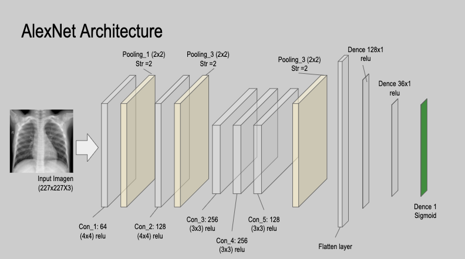

=============
### Mod 4 project
=============

by: Mendel Oster, Andres Chaves

This project was used as Mod 4 project for Flatiron School Data Science program.

================================================================================

    ├── Data                 <- The original, immutable data dump.
    |
    ├── Notebooks            <- Jupyter notebooks.
    |
    ├── Reports              <- Generated analysis as HTML, PDF, Slides, etc.
    |
    ├── README.md            <- The top-level README for developers using this project.
    |

===============================================================================

In this study, a deep learning model is proposed for the automatic diagnosis of Pneumonia. The proposed model is developed to provide accurate diagnostics for binary classification (normal vs. Pneumonia)  Our final model produced an average classification accuracy of 91.35% .

# Medeling

The first model is a recreation of an AlexNet architecture

This model won the 2012 ImageNet ILSVRC challenge by a large margin: it achieved a top-five error rate of 17%, while the second best achieved only 26%! It was developed by Alex Krizhevsky (hence the name), Ilya Sutskever, and Geoffrey Hinton. It is similar to LeNet-5, only much larger and deeper, and it was the first to stack convolutional layers directly on top of one another, instead of stacking a pooling layer on top of each convolutional layer.

For the second and final model we used transfer learning with an Xception Model

Pretrained Xception Model
The Xception Model is a variant of the GoogLeNet architecture is worth noting: Xception 19 (which stands for Extreme Inception ) was proposed in 2016 by François Chollet (the author of Keras), and it significantly outperformed Inception-v3 on a huge vision task (350 million images and 17,000 classes). Just like Inception-v4, it merges the ideas of GoogLeNet and ResNet, but it replaces the inception modules with a special type of layer called a depthwise separable convolution layer (or separable convolution layer for short 20 ).
